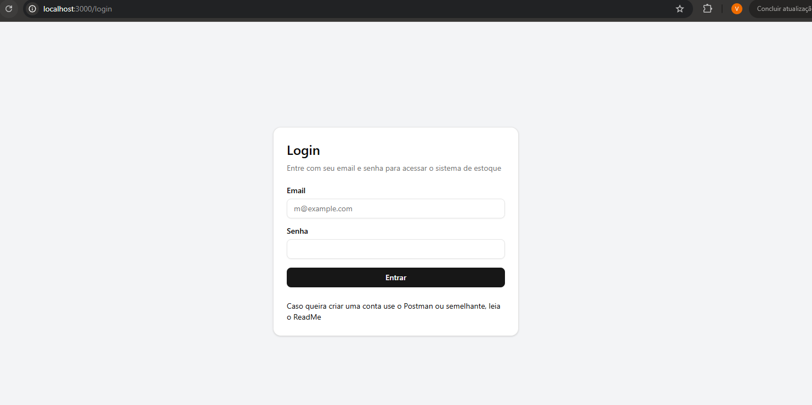
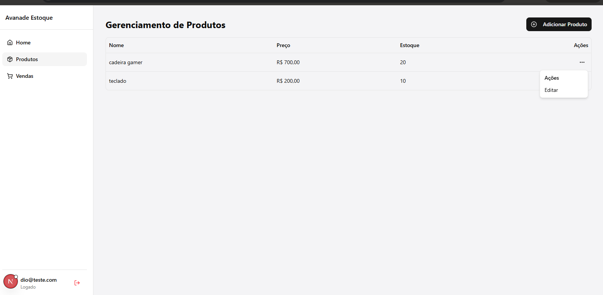
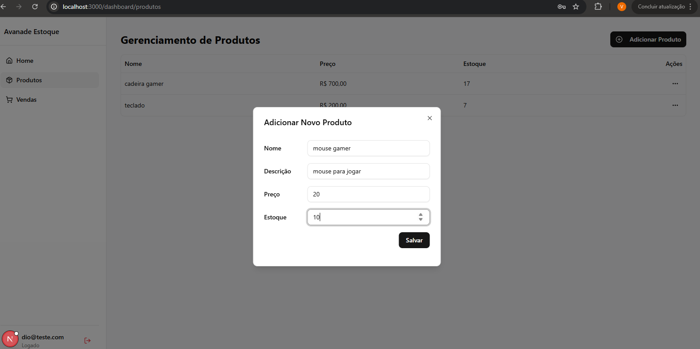
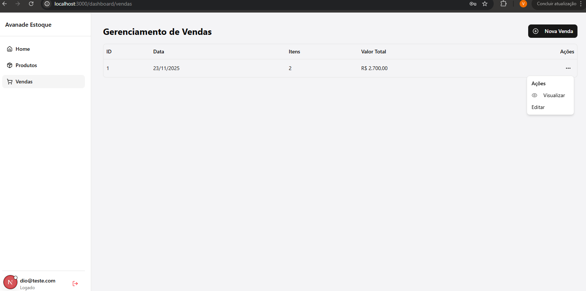
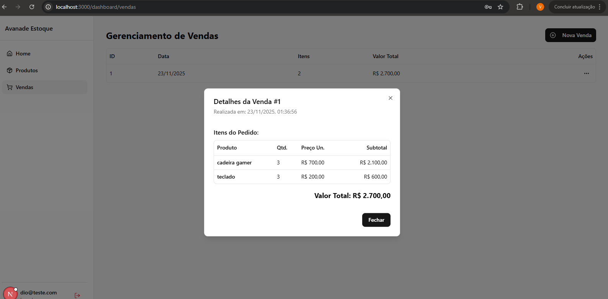
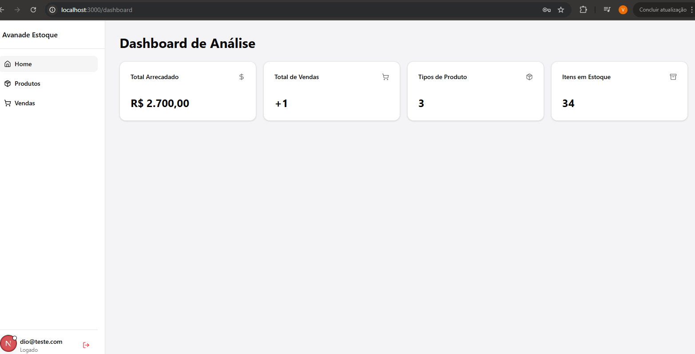

# Funcionalidades do Sistema

O sistema do desafio avanade conta com telas completas para gestão de estoque, vendas e autenticação Abaixo estão listadas as funcionalidades com as imagens do sistema

## Login



- Tela de autenticação.
- Validação de email e senha via serviço de Autenticação
- Redirecionamento para o painel após login bem sucedido

## Gerenciamento de Produtos

#### **Listagem de Produtos**



- Exibe todos os produtos cadastrados
- Mostra nome, quantidade, preço
- Ações rápidas de editar e excluir.

#### **Adicionar Produto**



- Formulário para cadastrar novos produtos
- Campos para nome, quantidade, preço
- Podendo tbm ao Adicionar ser Editado

## Vendas

### **Nova Venda**




- Página para adicionar uma nova venda
- Selecionar o produto cadastrado , quantidade e cálculo automático do valor total
- No backend tem a comunicação com o microserviço de Vendas via RabbitMQ se der erro e nao tiver estoque suficiente dispara o alerta que não tem estoque suficiente

### **Visualizar Venda**



- Tela de detalhes de uma venda especifica

## Estatísticas



- Dashboard com alguns dados do sistema


# Instalação e Configuração

Siga os passos abaixo para rodar o projeto localmente

## 1. Configuração do Banco de Dados
Certifique-se de ter o **MYSQL** rodando.

1. Crie um banco de dados vazio chamado **`estoquedb`**.
2. Aplique as Migrations para criar as tabelas (Autenticação,Estoque e Vendas).  
   No terminal, dentro da pasta de cada serviço rode (Importante ser na ordem acima Autenticação,Estoque e Vendas):
```bash
dotnet ef database update 
```

## 2. Executando o Backend (DOTNET E DOCKER)
Certifiuqe-se de esta na pasta backend no terminal e rode um restore

```bash
dotnet restore
```

agora rode um docker para o RabbitMQ para comunicação dos microserviços

```bash
docker run -d --name rabbitmqavanade -p 5672:5672 -p 15672:15672 rabbitmq:3-management
```

Com o docker aberto abra cada serviço indo em cada pasta do 

Terminal 1 - Gateway

```bash
cd src/Gateway.API
dotnet run
```

Terminal 2 - Autenticação

```bash
cd src/Servicos/Autenticacao.API
dotnet run
```

Terminal 3 - Estoque

```bash
cd src/Servicos/Estoque.API
dotnet run
```
Terminal 4 - Vendas

```bash
cd src/Servicos/Vendas.API
dotnet run
```

## 3. Crie o primeiro usuário usando o postman ou semelhante
 O Front end optei por não colocar tela de cadastro
- Rota: POST http://localhost:5188/api/autenticacao/registrar

Corpo da requisição
```bash
{
  "email": "avanade@admin.com",
  "password": "avanade2026"
}
```

## 4. Executando o Frontend (NEXT.JS)
Abra um novo terminal na pasta de front end e instale as dependências

```bash
npm install
# DEPOIS DE INSTALADO PODE RODAR O SISTEMA
npm run dev
```

O sistema estará acessível em: http://localhost:3000

## Testes Unitários

Este projeto tem testes unitários para as apis de **Vendas** e **Estoque** garantindo que as principais regras de negócio funcionem como esperado

Utilizamos:
- **xUnit**  
- **Entity Framework Core In-Memory** 
- **Moq** 

---

## Testes Implementados

### 1. **Teste do ProdutosController**
**Arquivo:** `ProdutosControllerTests.cs`  
**Método testado:** `ListarProdutos()`

**O que ele faz?**
- Cria um banco de dados falso em memória.  
- Insere dois produtos: **"mouse gamer"** e **"teclado mecanico"**.  
- Chama o endpoint `ListarProdutos`.  
- Valida se:
  - A resposta é **200 OK**
  - A lista contém **exatamente 2 produtos** cadastrados.


### 2. **Teste do VendasController**
**Arquivo:** `VendasControllerTests.cs`  
**Método testado:** `GetEstatisticas()`

**O que ele faz?**
- Usa **Moq** para simular dependências complexas, como `IHttpClientFactory` e `IMessageProducer`.  
- Adiciona dois pedidos falsos no banco em memória.  
- Chama o endpoint `GetEstatisticas`.  
- Valida se o DTO retorna corretamente:
  - **Total de vendas**
  - **Soma dos valores** de todos os pedidos


## Como Executar

Para rodar todos os testes do projeto va para 
```bash
backend\src\Vendas.Tests> 
```
e rode : 
```bash
dotnet test
```

